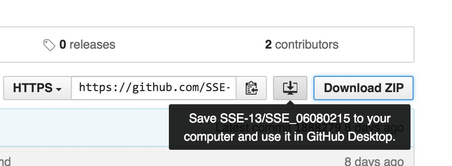
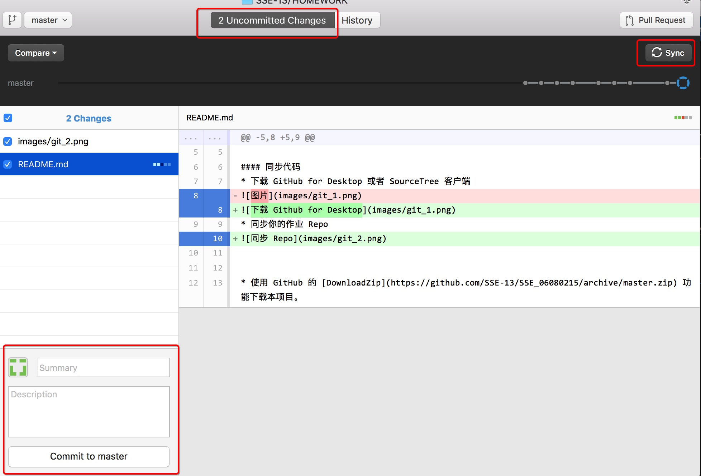

# 如何完成作业

### 准备工作


#### 软件下载
* 下载并安装 Node.js
* 下载 GitHub for Desktop 或者 SourceTree 客户端
* 下载并安装 Visual Studio Code 客户端

#### 同步代码
* 将 GitHub 中的项目```SSE_${学号})```同步到本地

* 使用 VisualStudioCode 打开本地项目文件夹 （ File - Open Folder )
* 随意修改 README.md 文件，并提交回 GitHub，并在 Github网站上确认提交成功


> 在 Github for Desktop 中，先进行 commit ，再进行 sync
> 在 SourceTree 中，先进行 commit ，再进行 push

#### 准备作业
* 使用 GitHub 的 [DownloadZip](https://github.com/SSE-13/SSE_06080215/archive/master.zip) 功能下载本项目。
* 解压本项目，将 ``` canvas_oop ``` , ```package.json```,```start.js```和```.gitignore```解压到作业项目的根目录下。
* 打开命令行，进入作业项目根目录，执行 ``` npm install ```
* 执行 ``` node start.js canvas_oop ```，启动一个HTTP服务器
* 打开 Chrome浏览器，输入 ```localhost:3000```，如果能看到内容，表示准备工作完成
* 在整个开发过程中，请不要关闭命令行，以保证服务器一直处于开启状态

#### 作业内容
* 在 ```canvas_oop```文件夹中创建一个新的 ```README.md``` 文件，并在其中上传一张任意 2D 游戏的截图。
* 修改 ```canvas_oop``` 文件夹中的 ```.ts```文件，编写逻辑，绘制简单的游戏画面（可以很粗糙），实现上述游戏的静态画面。
* 注意，不要修改任何的 ```.js ```文件

#### 注意事项
* 必须使用 Bitmap , TextField 等类，并修改其实现，完善其可扩展性，如 TextField 的自定义文字内容等功能。
* 不允许直接把游戏截图作为一个 Bitmap 使用，必须进行分层渲染，如：游戏场景、游戏人物、游戏界面。
* 完成后的项目结构应该如下：
```
project-path
    |-- canvas_oop
        |-- README.md // 作业2的Markdown文件（游戏截图）
        |-- canvas-oop.ts // 作业2源代码
        |-- 其他文件 
    |-- node_modules // 此文件夹不会被提交到GitHub
    |-- .gitignore // git忽略列表
    |-- start.js // 启动服务器脚本
    |-- README.md // 作业1的Markdown文件（自我介绍）
```
